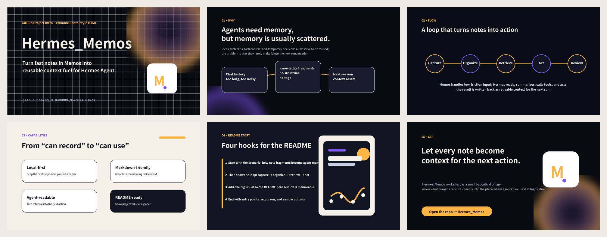

# Personal Memo for Hermes

[简体中文](README.zh-CN.md) | **English**



Local-first personal memo, task, link, and reminder management for [Hermes Agent](https://hermes-agent.nousresearch.com/).

Personal Memo stores durable data in SQLite and exposes one shared business core through a native Hermes plugin, slash commands, a CLI adapter, and an optional stdio MCP server. It supports plain-text notes and tasks as well as links, articles, videos, deadlines, reminders, history, backups, and schema migrations.

## Highlights

- Agent-assisted capture: extract a concise summary, item type, dates, reminders, and priority from natural language.
- Link ingestion with URL canonicalization, duplicate detection, bounded metadata parsing, source summaries, and retry support.
- Native Hermes tools plus convenient commands such as `/memos`, `/memos_add`, `/memos_detail`, `/memos_done`, `/memos_delete`, `/memos_edit`, `/memos_search`, `/memos_today`, and `/memos_fresh_all`.
- Stable numbered views for Telegram and other chat interfaces.
- Local SQLite storage with WAL mode, transactions, idempotent writes, scoped snapshots, audit history, rotating database backups, and integrity checks.
- Optional MCP access for other compatible clients, using the same database and core logic.

## Architecture

```text
Hermes plugin ─────┐
Slash commands ────┼──> personal_memo_core ──> SQLite
CLI / MCP adapter ─┘              └──────────> backups and migrations
```

`personal_memo_core` owns schema, migrations, parsing, source ingestion, state transitions, backups, and business rules. The plugin, CLI, and MCP server are thin adapters around it.

## Requirements

- Python 3.10+
- A working Hermes installation for the native plugin
- No third-party dependency for the plugin or CLI
- Optional MCP dependencies are listed in `mcp/requirements-mcp.txt`

## Install

From the repository root:

```bash
python3 install.py
hermes plugins enable personal-memo
```

Restart the Hermes gateway or start a new session. The installer replaces the installed code, skill, plugin, and MCP adapter without creating component-directory backups. Database backups and migration safeguards remain managed by the core library.

The default database is:

```text
~/.hermes/data/personal-memo/memos.sqlite3
```

## Common commands

```text
/memos
/memos_add Remember to review the experiment data tomorrow afternoon
/memos_detail 2
/memos_done 2
/memos_delete 2
/memos_edit 2 move it to next Monday
/memos_search Python
/memos_today
/memos_fresh 2
/memos_fresh_all
```

The refresh commands re-run structured LLM extraction using the configured Hermes persona and user-profile context, while preserving the original memo content.

## Usage examples

Personal Memo is designed to preserve what the user said while turning it into something actionable. The original text is retained; the agent fills in only derived fields that make the memo easier to find, plan, and revisit.

### Turn a casual instruction into a scheduled task

```text
/memos_add Finish organizing the experiment data by 18:00 tomorrow
```

The saved item keeps the original request and can derive a concise title, a task type, a deadline at 18:00 in the configured timezone, an agent-inferred plan time, and two exact reminders: five hours and one hour before the deadline. A date with no time means local midnight.

### Save a link with the reason it matters

```text
/memos_add Save this for the next paper-figure workflow: https://example.org/article
```

The URL is saved immediately so it cannot be lost. The plugin then parses safe page metadata and lets the agent combine the page title, source summary, key points, and the user's note into a useful memo title. `/memos_fresh 2` repeats that same ingest-and-analysis pipeline later without changing the original content or stable ID.

### Capture a short, underspecified note

```text
/memos_add Remember to have dinner at 18:00
```

This becomes a task with `due_at` at 18:00, reminders at 13:00 and 17:00, and an inferred `scheduled_for` when the surrounding memo context supports one. If the system has insufficient evidence, it leaves a field empty or marks the recommendation as an inference instead of inventing facts.

### Receive planning help instead of a repeated list

At 09:00, the morning job can turn active memos, upcoming deadlines, link summaries, durable user profile context, and recent activity into up to three focused recommendations. At 20:00, the evening job suggests a small number of low-friction wrap-up actions and preparations for tomorrow. These jobs never complete, delete, postpone, or reprioritize a memo automatically.

## Optional MCP server

Install the optional dependencies:

```bash
python3 -m pip install -r mcp/requirements-mcp.txt
```

Run `mcp/server.py` over stdio from an MCP-compatible client. Point it at the same `HERMES_HOME` so all clients share one database.

## Development

```bash
python3 -m unittest discover -s skill/tests -v
python3 -m py_compile install.py core/personal_memo_core/service.py plugin/*.py
```

## Repository layout

```text
core/personal_memo_core/  Shared database and business logic
plugin/                   Hermes plugin registration and handlers
mcp/                      Optional stdio MCP adapter
skill/                    Hermes Skill, references, and tests
install.py                Installer and upgrade entry point
```

Issues and pull requests are welcome. Keep business behavior in `personal_memo_core`; framework adapters should remain thin.
